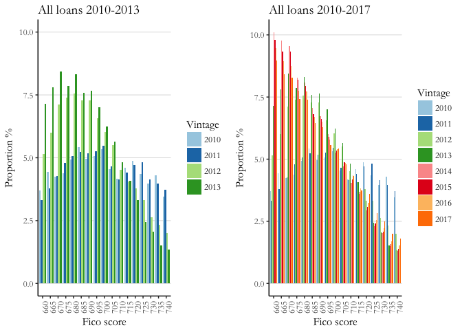
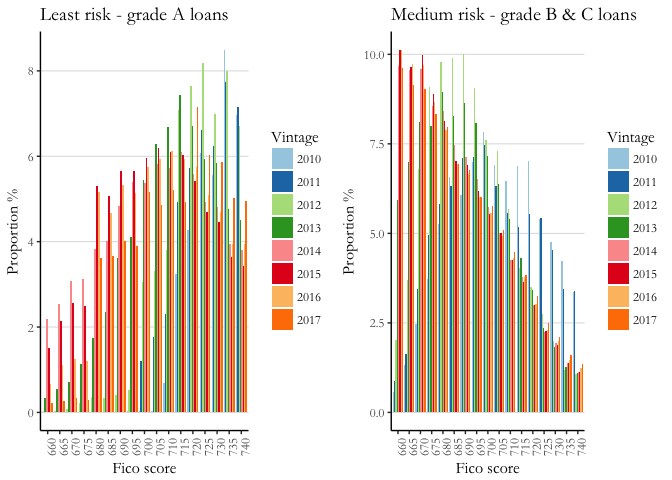
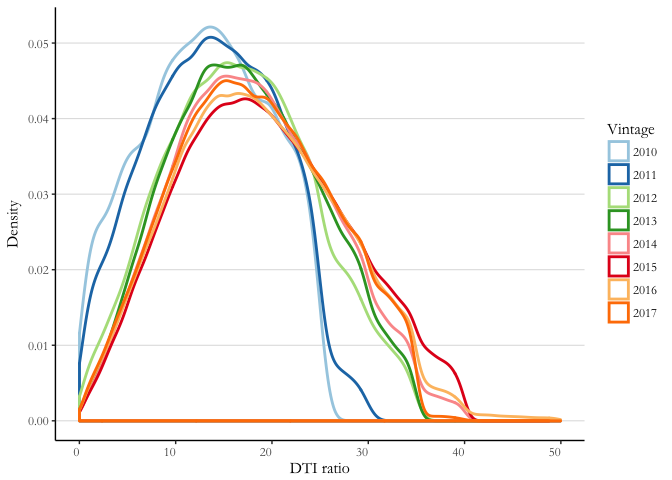
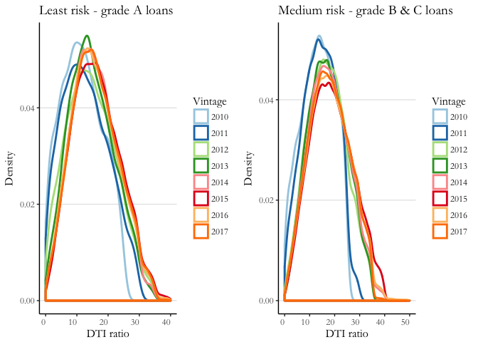
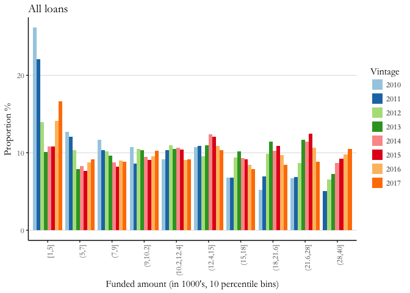
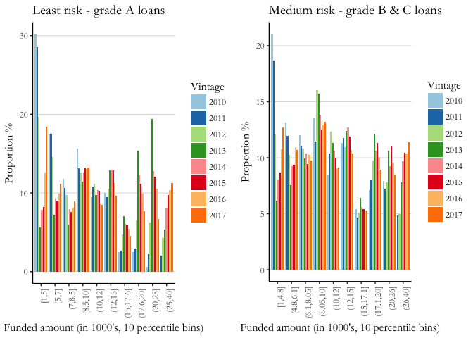

Credit risk analysis by vintage
================
Abha Kapoor
2018-03-17

<font color=blue>Project Goal</font>: In this post, I provide evidence on Lending Club's declining underwriting standards. I compare the distribution of important risk factors like borrower's FICO, DTI and loan amount across different vintages and find observable shifts in risk factors for later vintage loans. FICO scores become progressively lower and Debt-to-income ratios become progressively higher. Now if these riskier borrowers were also borrowing smaller loan amounts, loans with shorter terms or higher interest rates then I could argue that Lending Club is accounting for the higher levels of borrower risk wen structuring these loans. Yet we do not see such evidence - several large loan amounts are issued and the proportion of 3-year term loans remains stable over time.

<font color=blue>Preprocessing data</font>: I first remove erroneous loans i.e. loans with missing funded amounts, loans with missing ID's and loans with final statuses as "Does not meet the credit policy. Status:Charged Off" or "Does not meet the credit policy. Status:Fully Paid". I also discard joint application loans which form a very small portion of my loan sample. Finally I discard loans originated in the financial crisis years of 2007-2009. Since few loans were originated during this period, there isn't any loss in generality when dropping these vintages.

``` r
df$id <- as.numeric(df$id)
df$issue_date <- as.Date(paste("01",df$issue_d,sep="-"),format='%d-%b-%y') 
df$issue_year <- year(df$issue_date)
df <- subset(df, application_type!="Joint App")
df$application_type <- factor(df$application_type)

df <- subset(df, !is.na(funded_amnt) & !is.na(id) & !is.na(issue_date))
miss_data <- data.frame(perc_missing = sapply(df, 
                                              function(x) as.numeric(as.character(sum(is.na(x))))))*100/length(df$id)
rm_cols <- rownames(subset(miss_data, perc_missing>=90))
df <- df[, !(names(df) %in% rm_cols)]

df <- subset(df, loan_status!="" & 
               loan_status!="Does not meet the credit policy. Status:Charged Off" &
               loan_status!="Does not meet the credit policy. Status:Fully Paid")
df$loan_status <- factor(df$loan_status)
df <- subset(df, issue_year>2009)
```

<font color=blue>FICO distribution across vintages</font>:

``` r
df1 <- df[, c("grade", "fico_range_low", "fico_range_high", "issue_year")]
df1 <- subset(df1, !is.na(fico_range_low) & !is.na(issue_year))

color_pal <- c(brewer.pal(name="Paired", n=9))
df2 <- df1 %>%
  group_by(fico_range_low, issue_year) %>%
  summarise(count_fico_year=n())
df3 <- df1 %>%
  group_by(issue_year) %>%
  summarise(count_year=n())
df2 <- inner_join(df2, df3)
df2$prop_year <- df2$count_fico_year*100/df2$count_year

g1 <- ggplot(subset(df2, fico_range_low>=660 & fico_range_low<=740 & issue_year<=2013)) + 
  geom_bar(aes(x=factor(as.character(fico_range_low)), y=prop_year, 
               fill=factor(as.character(issue_year))), stat="identity", 
           position=position_dodge()) +
  theme_classic() + labs(x="Fico score", y="Proportion %", title="All loans 2010-2013") +
  scale_fill_manual(values=color_pal) + 
  theme(axis.text.x = element_text(angle=90, hjust=1), text=element_text(family="Garamond", size=12),
        panel.grid.major.y=element_line(color="grey87")) +
  guides(fill=guide_legend(title="Vintage")) + 
  scale_y_continuous(limits=c(0, 10))

g2 <- ggplot(subset(df2, fico_range_low>=660 & fico_range_low<=740)) + 
  geom_bar(aes(x=factor(as.character(fico_range_low)), y=prop_year, 
               fill=factor(as.character(issue_year))), stat="identity", 
           position=position_dodge()) +
  theme_classic() + labs(x="Fico score", y="Proportion %", title="All loans 2010-2017") +
  scale_fill_manual(values=color_pal) + 
  theme(axis.text.x = element_text(angle=90, hjust=1), 
        text=element_text(family="Garamond", size=12),
        panel.grid.major.y=element_line(color="grey87")) +
  guides(fill=guide_legend(title="Vintage"))
grid.arrange(arrangeGrob(g1, g2, ncol=2, nrow=1))
```



``` r
df2 <- subset(df1, grade=="A") %>%
  group_by(fico_range_low, issue_year) %>%
  summarise(count_fico_year=n())
df3 <- subset(df1, grade=="A") %>%
  group_by(issue_year) %>%
  summarise(count_year=n())
df2 <- inner_join(df2, df3)
df2$prop_year <- df2$count_fico_year*100/df2$count_year

g3 <- ggplot(subset(df2, fico_range_low>=660 & fico_range_low<=740)) + 
  geom_bar(aes(x=factor(as.character(fico_range_low)), y=prop_year, 
               fill=factor(as.character(issue_year))), stat="identity", 
           position=position_dodge()) +
  theme_classic() + labs(x="Fico score", y="Proportion %", title="Least risk - grade A loans") +
  scale_fill_manual(values=color_pal) + 
  theme(axis.text.x = element_text(angle=90, hjust=1), 
        text=element_text(family="Garamond", size=12),
        panel.grid.major.y=element_line(color="grey87")) +
  guides(fill=guide_legend(title="Vintage"))

df2 <- subset(df1, grade=="B"|grade=="C") %>%
  group_by(fico_range_low, issue_year) %>%
  summarise(count_fico_year=n())
df3 <- subset(df1, grade=="B"|grade=="C") %>%
  group_by(issue_year) %>%
  summarise(count_year=n())
df2 <- inner_join(df2, df3)
df2$prop_year <- df2$count_fico_year*100/df2$count_year

g4 <- ggplot(subset(df2, fico_range_low>=660 & fico_range_low<=740)) + 
  geom_bar(aes(x=factor(as.character(fico_range_low)), y=prop_year, 
               fill=factor(as.character(issue_year))), stat="identity", 
           position=position_dodge()) +
  theme_classic() + labs(x="Fico score", y="Proportion %", title="Medium risk - grade B & C loans") +
  scale_fill_manual(values=color_pal) + 
  theme(axis.text.x = element_text(angle=90, hjust=1), 
        text=element_text(family="Garamond", size=12),
        panel.grid.major.y=element_line(color="grey87")) +
  guides(fill=guide_legend(title="Vintage"))
grid.arrange(arrangeGrob(g3, g4, ncol=2, nrow=1))
```



<font color=blue>Debt-to-Income ratio distribution across vintages</font>:

``` r
df1 <- df[, c("grade", "issue_year", "dti")]
df1 <- subset(df1, !is.na(dti) & !is.na(issue_year) & dti>0)

ggplot(df1) + geom_density(aes(x=dti, color=factor(issue_year)), size=1) + theme_classic() + 
  labs(x="DTI ratio", y="Density", y="All loans") +
  scale_color_manual(values=color_pal) + 
  theme(axis.text.x = element_text(angle=0, hjust=1), 
        text=element_text(family="Garamond", size=12),
        panel.grid.major.y=element_line(color="grey87")) +
  guides(color=guide_legend(title="Vintage")) 
```



``` r
g1 <- ggplot(subset(df1, grade=="A")) + geom_density(aes(x=dti, color=factor(issue_year)), size=1) + 
  theme_classic() + 
  labs(x="DTI ratio", y="Density", title="Least risk - grade A loans") +
  scale_color_manual(values=color_pal) + 
  theme(axis.text.x = element_text(angle=0, hjust=1), 
        text=element_text(family="Garamond", size=12),
        panel.grid.major.y=element_line(color="grey87")) +
  guides(color=guide_legend(title="Vintage")) 

g2 <- ggplot(subset(df1, grade=="B"|grade=="C")) + 
  geom_density(aes(x=dti, color=factor(issue_year)), size=1) + theme_classic() + 
  labs(x="DTI ratio", y="Density", title="Medium risk - grade B & C loans") +
  scale_color_manual(values=color_pal) + 
  theme(axis.text.x = element_text(angle=0, hjust=1), 
        text=element_text(family="Garamond", size=12),
        panel.grid.major.y=element_line(color="grey87")) +
  guides(color=guide_legend(title="Vintage"))

grid.arrange(arrangeGrob(g1, g2, ncol=2, nrow=1))
```



<font color=blue>Loan amounts distribution across vintages</font>:

``` r
df1 <- df[, c("grade", "issue_year", "funded_amnt")]
df1 <- subset(df1, !is.na(funded_amnt) & !is.na(issue_year) & funded_amnt>0)
df1$funded_amnt <- df1$funded_amnt/1000

df1$funded_amnt_perc <- cut(df1$funded_amnt, breaks=quantile(df1$funded_amnt, 
                                                             probs=seq(0, 1, 0.10)), include.lowest=TRUE)
df2 <- df1 %>%
  group_by(funded_amnt_perc, issue_year) %>%
  summarise(count_amnt_year=n())
df3 <- df1 %>%
  group_by(issue_year) %>%
  summarise(count_year=n())
df2 <- inner_join(df2, df3)
df2$prop_year <- df2$count_amnt_year*100/df2$count_year

ggplot(df2) + 
  geom_bar(aes(x=funded_amnt_perc, y=prop_year, 
               fill=factor(as.character(issue_year))), stat="identity", 
           position=position_dodge(), size=1.5) +
  theme_classic() + labs(x="Funded amount (in 1000's, 10 percentile bins)", y="Proportion %", 
                         title="All loans") +
  scale_fill_manual(values=color_pal) + 
  theme(axis.text.x = element_text(angle=90, hjust=1), 
        text=element_text(family="Garamond", size=12),
        panel.grid.major.y=element_line(color="grey87")) +
  guides(fill=guide_legend(title="Vintage")) 
```



``` r
df1 <- df[, c("grade", "issue_year", "funded_amnt")]
df1 <- subset(df1, !is.na(funded_amnt) & !is.na(issue_year) & funded_amnt>0 & grade=="A")
df1$funded_amnt <- df1$funded_amnt/1000

df1$funded_amnt_perc <- cut(df1$funded_amnt, breaks=quantile(df1$funded_amnt, 
                                                             probs=seq(0, 1, 0.10)), include.lowest=TRUE)
df2 <- df1 %>%
  group_by(funded_amnt_perc, issue_year) %>%
  summarise(count_amnt_year=n())
df3 <- df1 %>%
  group_by(issue_year) %>%
  summarise(count_year=n())
df2 <- inner_join(df2, df3)
df2$prop_year <- df2$count_amnt_year*100/df2$count_year

g1 <- ggplot(df2) + 
  geom_bar(aes(x=funded_amnt_perc, y=prop_year, 
               fill=factor(as.character(issue_year))), stat="identity", 
           position=position_dodge()) +
  theme_classic() + labs(x="Funded amount (in 1000's, 10 percentile bins)", y="Proportion %", 
                         title="Least risk - grade A loans") +
  scale_fill_manual(values=color_pal) + 
  theme(axis.text.x = element_text(angle=90, hjust=1), 
        text=element_text(family="Garamond", size=12),
        panel.grid.major.y=element_line(color="grey87")) +
  guides(fill=guide_legend(title="Vintage")) 

df1 <- df[, c("grade", "issue_year", "funded_amnt")]
df1 <- subset(df, !is.na(funded_amnt) & !is.na(issue_year) & funded_amnt>0 & 
                (grade=="B"|grade=="C"))
df1$funded_amnt <- df1$funded_amnt/1000

df1$funded_amnt_perc <- cut(df1$funded_amnt, breaks=quantile(df1$funded_amnt, 
                                                             probs=seq(0, 1, 0.10)), include.lowest=TRUE)
df2 <- df1 %>%
  group_by(funded_amnt_perc, issue_year) %>%
  summarise(count_amnt_year=n())
df3 <- df1 %>%
  group_by(issue_year) %>%
  summarise(count_year=n())
df2 <- inner_join(df2, df3)
df2$prop_year <- df2$count_amnt_year*100/df2$count_year

g2 <- ggplot(df2) + 
  geom_bar(aes(x=funded_amnt_perc, y=prop_year, 
               fill=factor(as.character(issue_year))), stat="identity", 
           position=position_dodge()) +
  theme_classic() + labs(x="Funded amount (in 1000's, 10 percentile bins)", y="Proportion %", 
                         title="Medium risk - grade B & C loans") +
  scale_fill_manual(values=color_pal) + 
  theme(axis.text.x = element_text(angle=90, hjust=1), 
        text=element_text(family="Garamond", size=12),
        panel.grid.major.y=element_line(color="grey87")) +
  guides(fill=guide_legend(title="Vintage")) 

grid.arrange(arrangeGrob(g1, g2, nrow=1, ncol=2))
```


